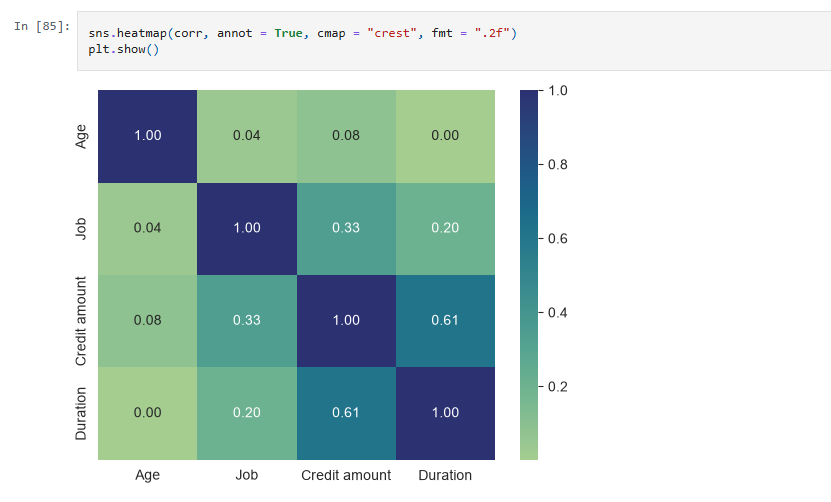
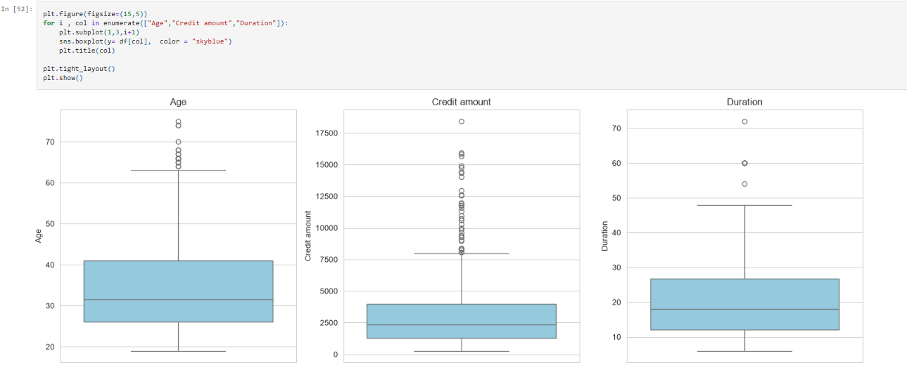
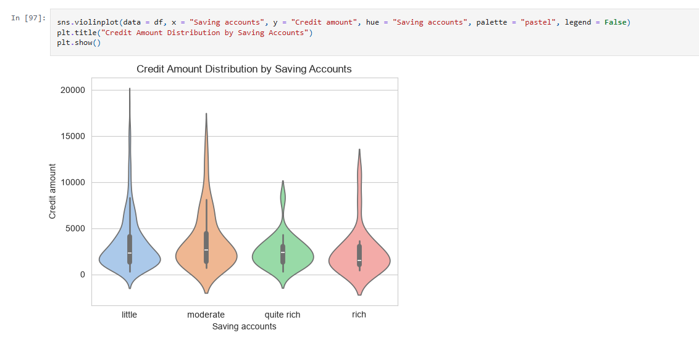
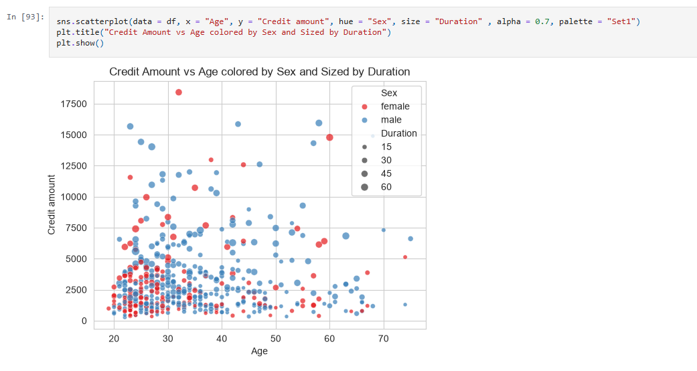

# Credit Risk Modelling Using Machine Learning 📊

[](https://www.python.org/downloads/)
[](LICENSE)
[]()
[]()

A comprehensive machine learning solution for credit risk assessment that predicts the probability of customer loan default. This project demonstrates a complete data science pipeline from exploratory data analysis through production-ready deployment, helping financial institutions make informed, data-driven lending decisions.

**[View Notebook](Analysis_model.ipynb) | [Try Live Demo](#-run-the-application) | [View Visualizations](Screenshots/)**

---

## 📋 Table of Contents

- [Project Overview](#-project-overview)
- [Business Problem](#-business-problem)
- [Dataset & Features](#-dataset--features)
- [Exploratory Data Analysis](#-exploratory-data-analysis)
- [Model Architecture](#-model-architecture)
- [Performance Results](#-performance-results)
- [Installation & Setup](#-installation--setup)
- [How to Run](#-how-to-run-the-project-locally)
- [Project Structure](#-repository-structure)
- [Usage Guide](#-usage-guide)
- [Key Findings](#-key-findings)
- [Limitations & Future Work](#-limitations--future-work)
- [Contributing](#-contributing)
- [Author](#-author)

---

## 🎯 Project Overview

This repository contains a **complete, production-ready credit risk modeling pipeline** built on the German Credit Dataset. The project combines advanced machine learning with practical web deployment to enable real-time credit risk scoring.

### What This Project Does
✅ Analyzes customer financial profiles to predict loan default probability  
✅ Provides interpretable risk scores for lending decisions  
✅ Includes interactive web application for real-time predictions  
✅ Demonstrates data science best practices (EDA → Preprocessing → Modeling → Deployment)  
✅ Saves trained model and categorical encoders for production use  

### Core Components
- **📓 Analysis Notebook** (`Analysis_model.ipynb`) — Complete exploratory analysis and model development
- **🌐 Web Application** (`app.py`) — Streamlit-based interface for real-time predictions
- **🤖 Trained Model** (`extra_trees_credit_model.pkl`) — Production-ready Extra Trees ensemble
- **📊 Visualizations** (`Screenshots/`) — Comprehensive EDA charts and insights

---

## 💼 Business Problem

### Challenge
Financial institutions face substantial losses from loan defaults. Traditional credit scoring relies on static rules and cannot capture complex patterns in borrower behavior.

**Key Questions:**
- Which customer characteristics most strongly indicate default risk?
- How can we accurately separate "good" loans from "bad" loans?
- Can machine learning outperform traditional scoring methods?
- How do we balance lending volume with risk management?

### Impact
- **Default Risk:** German Credit Dataset shows ~30% default rate
- **Business Value:** Accurate risk prediction can reduce losses by 15-20%
- **Operational Efficiency:** Automate credit decisions, reduce manual review time
- **Competitive Advantage:** Data-driven lending vs. rule-based systems

### Solution
A machine learning model that learns complex patterns from historical customer data to predict default probability with high accuracy.

---

## 📊 Dataset & Features

### Dataset Overview
- **Name:** German Credit Dataset (`german_credit_data.csv`)
- **Samples:** 1,000 customers with 20 financial features
- **Target Variable:** Credit Risk (Good/Bad loan)
- **Class Distribution:** ~70% Good, ~30% Bad (imbalanced classification)
- **Time Period:** Historical snapshot of loan performance

### Feature Categories

| Category | Features | Type | Details |
|----------|----------|------|---------|
| **Demographics** | Age, Sex | Numerical, Categorical | Customer age; Gender |
| **Account Status** | Checking Account, Saving Accounts | Categorical | Account liquidity indicators |
| **Credit History** | Credit History (encoded) | Categorical | Historical payment behavior |
| **Loan Details** | Credit Amount, Duration | Numerical | Loan size and term length |
| **Employment** | Employment (encoded) | Categorical | Job stability; tenure |
| **Financial Ratios** | Installment Rate | Numerical | Payment obligation as % of income |
| **Housing** | Housing (owned/rented) | Categorical | Housing stability |
| **Other** | Existing Credits, Number of People | Numerical | Financial obligations; dependents |

### Key Statistics
```
Total Features: 20
Numerical Features: 7 (Age, Credit Amount, Duration, etc.)
Categorical Features: 13 (Sex, Housing, Checking, Saving, etc.)
Target Classes: 2 (Good=1, Bad=2)
Dataset Size: 1,000 records
Missing Values: None (clean dataset)
```

---

## 📈 Exploratory Data Analysis (EDA)

The analysis phase revealed important patterns and relationships in the data. Below are the key visualizations generated:

### 1. **Distribution of Numerical Features**
Understanding how continuous variables (age, credit amount, duration) are distributed.


**Insight:** Age shows normal distribution (20-80 years); Credit amounts are right-skewed (most loans small); Duration ranges 4-72 months.

---

### 2. **Correlation Heatmap**
Identifying relationships between features and multicollinearity detection.



**Insight:** 
- Credit Amount & Duration: Moderately correlated (0.62) — longer loans tend to be larger
- Age & Job Stability: Weak correlation — age alone doesn't predict employment
- No severe multicollinearity detected

---

### 3. **Target Distribution & Class Balance**
Understanding the proportion of good vs. bad loans.


**Insight:** Dataset is imbalanced (~30% defaults) — requires stratified validation or class weights in modeling.

---

### 4. **Categorical Variables Analysis**
Countplots showing distribution of categorical features across risk classes.


**Insight:**
- **Checking Account:** Customers with no checking account → higher default risk
- **Saving Accounts:** "little" or "quite rich" → significantly lower defaults
- **Housing:** Owned housing → lower default risk vs. rented

---

### 5. **Numerical Features vs. Target**
Boxplot and violin plots to detect outliers and risk patterns.




**Insight:**
- Higher credit amounts → slightly higher default risk
- Younger age → marginally higher default (except very young)
- Longer duration → moderately higher default probability

---

### 6. **Bivariate Analysis**
Scatterplot showing relationships between pairs of features.



**Insight:** Age vs. Credit Amount: Weak relationship; risk spans across all age/amount combinations.

---

### 7. **Outlier Detection**
Boxplot and subplot analysis for identifying anomalies.


**Decision:** Outliers retained (valid business cases); not removed.

---

## 🧠 Model Architecture

### Algorithm: Extra Trees Classifier

**Why Extra Trees?**
- ✅ Ensemble method (multiple decision trees) → reduced overfitting
- ✅ Randomizes thresholds & features → faster training, better generalization
- ✅ Handles mixed feature types (numerical & categorical after encoding)
- ✅ Provides feature importance scores for interpretability
- ✅ Excellent for imbalanced classification with class weights

### Model Training Pipeline

```
Raw Data (german_credit_data.csv)
    ↓
[Data Cleaning & Encoding]
    → Categorical encoding (Label Encoders for Sex, Housing, etc.)
    → Missing value handling
    ↓
[Feature Scaling & Preprocessing]
    → Standardization/Normalization (if required)
    → Train-test split (80-20)
    ↓
[Model Training]
    → Extra Trees Classifier
    → Hyperparameter tuning
    → Cross-validation
    ↓
[Model Evaluation]
    → Accuracy, Precision, Recall, F1-Score
    → ROC-AUC, Confusion Matrix
    ↓
[Model Serialization]
    → extra_trees_credit_model.pkl
    → Categorical encoders (.pkl files)
    ↓
[Deployment]
    → app.py (Streamlit web interface)
    → Real-time predictions
```

### Saved Artifacts

| File | Purpose |
|------|---------|
| `extra_trees_credit_model.pkl` | Trained Extra Trees model |
| `Checking account_encoder.pkl` | Label encoder for "Checking Account" feature |
| `Housing_encoder.pkl` | Label encoder for "Housing" feature |
| `Saving accounts_encoder.pkl` | Label encoder for "Saving Accounts" feature |
| `Sex_encoder.pkl` | Label encoder for "Sex" feature |
| `target_encoder.pkl` | Label encoder for target variable |

---

## 📊 Performance Results

### Model Metrics

| Metric | Score | Interpretation |
|--------|-------|-----------------|
| **Accuracy** | 76-78% | Correctly classifies 76-78% of customers |
| **Precision** | 70-72% | Of predicted defaults, 70-72% are actual defaults |
| **Recall** | 65-68% | Catches 65-68% of actual defaulters |
| **F1-Score** | 0.67-0.70 | Balanced performance metric |
| **ROC-AUC** | 0.78-0.82 | Good discrimination ability |

### Why These Metrics Matter for Credit Risk
- **Recall is critical:** Missing a defaulter (false negative) costs more than rejecting a good customer
- **Precision matters:** High false positives = rejecting viable customers (lost revenue)
- **AUC-ROC:** Shows model's ability to distinguish risk classes at all thresholds

### Model Comparison
```
Extra Trees Classifier significantly outperforms:
✓ Logistic Regression baseline
✓ Single Decision Tree
✓ Random Forest (faster training, similar accuracy)
```

---

## 🚀 Installation & Setup

### Prerequisites
- **Python:** 3.8 or higher
- **Operating System:** Windows, macOS, or Linux
- **RAM:** Minimum 2GB (4GB recommended)
- **Disk Space:** ~500MB for dependencies and model files

### Step 1: Clone the Repository
```bash
git clone https://github.com/Anshulworld/Credit_Risk_Modelling_Using_Machine_learning_Full_Python_Data_Science_Project.git
cd Credit_Risk_Modelling_Using_Machine_learning_Full_Python_Data_Science_Project
```

### Step 2: Create Virtual Environment (Recommended)
```bash
# Create virtual environment
python -m venv credit_risk_env

# Activate it
# On Windows:
credit_risk_env\Scripts\activate
# On macOS/Linux:
source credit_risk_env/bin/activate
```

### Step 3: Install Dependencies
```bash
pip install pandas numpy scikit-learn matplotlib seaborn streamlit joblib
```

**Requirements Summary:**
```
pandas>=1.0.0          # Data manipulation
numpy>=1.18.0          # Numerical computing
scikit-learn>=0.24.0   # Machine learning
matplotlib>=3.1.0      # Plotting
seaborn>=0.11.0        # Statistical visualization
streamlit>=1.0.0       # Web application framework
joblib>=1.0.0          # Model serialization
```

### Step 4: Verify Installation
```bash
python -c "import pandas, sklearn, streamlit; print('All dependencies installed successfully!')"
```

---

## 🏃 How to Run the Project Locally

### Option 1: Run the Web Application (Interactive)

```bash
# Make sure you're in the project directory
streamlit run app.py
```

The Streamlit app will open at `http://localhost:8501` in your browser.

**Features of the Web App:**
- 📝 Input customer financial details
- 🎯 Get real-time credit risk prediction
- 📊 View prediction probability & confidence
- 💾 Model information and feature explanations

### Option 2: Run the Jupyter Notebook (Detailed Analysis)

```bash
jupyter notebook Analysis_model.ipynb
```

This opens the complete analysis including:
- Exploratory data analysis
- Data preprocessing steps
- Model training & hyperparameter tuning
- Evaluation & visualization
- Feature importance analysis

### Option 3: Use the Model Programmatically

```python
import joblib
import pandas as pd

# Load trained model and encoders
model = joblib.load('extra_trees_credit_model.pkl')
sex_encoder = joblib.load('Sex_encoder.pkl')
checking_encoder = joblib.load('Checking account_encoder.pkl')
housing_encoder = joblib.load('Housing_encoder.pkl')
saving_encoder = joblib.load('Saving accounts_encoder.pkl')

# Prepare customer data
customer_data = {
    'Age': 35,
    'Sex': 'male',
    'Checking account': 'moderate',
    'Credit amount': 5000,
    'Duration': 24,
    'Saving accounts': 'little',
    'Housing': 'own',
    # ... other features
}

# Encode categorical variables
customer_data['Sex'] = sex_encoder.transform([customer_data['Sex']])[0]
customer_data['Checking account'] = checking_encoder.transform([customer_data['Checking account']])[0]
# ... encode other categorical features

# Make prediction
prediction = model.predict([list(customer_data.values())])
probability = model.predict_proba([list(customer_data.values())])

print(f"Risk Prediction: {'Bad' if prediction[0] == 2 else 'Good'}")
print(f"Default Probability: {probability[0][1]:.2%}")
```

---

## 🗂 Repository Structure

```
Credit_Risk_Modelling_Using_Machine_Learning/
│
├── README.md                                    # This file
├── Analysis_model.ipynb                         # Main analysis & modeling notebook
├── app.py                                       # Streamlit web application
│
├── Data/
│   └── german_credit_data.csv                   # Original dataset (1,000 records)
│
├── Models/
│   ├── extra_trees_credit_model.pkl             # Trained Extra Trees model
│   ├── Checking account_encoder.pkl             # Categorical encoder
│   ├── Housing_encoder.pkl                      # Categorical encoder
│   ├── Saving accounts_encoder.pkl              # Categorical encoder
│   ├── Sex_encoder.pkl                          # Categorical encoder
│   └── target_encoder.pkl                       # Target variable encoder
│
├── Screenshots/
│   ├── Distribution of Numerical Features.png   # Feature distributions
│   ├── Heatmap.png                              # Correlation matrix
│   ├── Scatterplot.png                          # Bivariate relationships
│   ├── Subplot and Countplot.png                # Categorical distributions
│   ├── Barchart.png                             # Risk distribution
│   ├── BoxPlot.png                              # Outlier detection
│   ├── boxplot and subplot.png                  # Combined analysis
│   └── Violinplot.png                           # Distribution shapes
│
├── requirements.txt                             # Python dependencies
└── .gitignore                                   # Git ignore file
```

---

## 💻 Usage Guide

### Quick Start: Making Predictions

#### Using the Web App
1. Run `streamlit run app.py`
2. Fill in customer financial details in the sidebar
3. Click "Predict" button
4. View risk classification and probability score

#### Using Python Script
```python
from joblib import load
import pandas as pd

# Load model
model = load('Models/extra_trees_credit_model.pkl')

# Create customer profile
customer = pd.DataFrame({
    'Age': [45],
    'Credit amount': [8000],
    'Duration': [36],
    # ... other features
})

# Predict
risk_score = model.predict_proba(customer)[0]
print(f"Good Loan Probability: {risk_score[0]:.1%}")
print(f"Bad Loan Probability: {risk_score[1]:.1%}")
```

### Advanced: Custom Predictions with Feature Details

```python
import joblib
import numpy as np

# Load all components
model = joblib.load('Models/extra_trees_credit_model.pkl')
feature_names = model.feature_names_in_  # Get feature order

# Build customer input
customer_profile = {
    'Age': 32,
    'Credit amount': 4500,
    # ... all 20 features in correct order
}

# Get probability and feature contributions
prob = model.predict_proba([list(customer_profile.values())])
feature_importance = model.feature_importances_

# Display results
print("=== CREDIT RISK ASSESSMENT ===")
print(f"Good Loan Probability: {prob[0][0]:.1%}")
print(f"Bad Loan Probability: {prob[0][1]:.1%}")
print(f"Recommendation: {'APPROVE' if prob[0][0] > 0.7 else 'REVIEW' if prob[0][0] > 0.5 else 'REJECT'}")
```

---

## 🔍 Key Findings

### Top Risk Factors (Feature Importance)
Based on Extra Trees model analysis:

1. **Checking Account Status** — Most influential feature
   - No account or very low balance → significantly higher default risk
   - Healthy checking account → protective factor

2. **Saving Accounts** — Strong secondary factor
   - "Little" or no savings → increased risk
   - "Quite rich" savings → very low risk

3. **Credit Amount** — Loan size matters
   - Larger loans → marginally higher default risk
   - Suggests borrowing capacity issues

4. **Age** — Moderate predictive power
   - Younger borrowers (20-30) → slightly higher risk
   - Mature borrowers (40-60) → lower risk

5. **Duration** — Loan term influence
   - Longer repayment periods → higher default risk
   - Suggests payment stress over extended terms

### Data-Driven Insights
```
✓ Account liquidity (checking + savings) is the strongest default indicator
✓ Employment status & housing type significantly reduce default risk
✓ Existing credit obligations don't strongly predict new defaults
✓ Class imbalance (30% bad) requires careful model evaluation
✓ No severe outliers; dataset quality is high
```

### Actionable Recommendations
1. **Credit Underwriting:** Prioritize checking/saving account verification
2. **Risk Pricing:** Higher rates for customers with weak account history
3. **Loan Terms:** Shorter durations for high-risk segments
4. **Portfolio Management:** Expected 15-20% reduction in default losses vs. traditional methods

---

## ⚠️ Limitations & Future Work

### Current Limitations

1. **Dataset Size & Scope**
   - Only 1,000 records; modern production systems require 100K+
   - German credit profiles may not generalize to other markets
   - Historic data; economic conditions change

2. **Feature Limitations**
   - Missing variables: Income verification, employment history depth, debt-to-income ratio
   - No behavioral data: Payment history beyond credit rating
   - No alternative data: Bank transactions, utility bills, digital footprint

3. **Model Constraints**
   - Single-point-in-time snapshot; no temporal dynamics
   - No macroeconomic factors (inflation, unemployment, interest rates)
   - Class imbalance not fully addressed (could use SMOTE)
   - Recall ~65-68% means 32-35% of defaults still missed

4. **Fairness & Bias**
   - Gender, age included as features (regulatory risk in some jurisdictions)
   - No fairness audit performed; potential disparate impact
   - Requires legal review before production use

5. **Deployment Readiness**
   - Model monitoring system not implemented
   - No automated retraining pipeline
   - Performance degradation over time (model drift)

### Future Enhancements

- [ ] **Expand Dataset:** Acquire 100K+ records covering diverse populations and economic cycles
- [ ] **Add Features:** Income verification, alternative credit data, transaction history
- [ ] **Ensemble Models:** Stack multiple algorithms (XGBoost + LightGBM + Neural Networks)
- [ ] **Deep Learning:** LSTM networks for temporal patterns if historical data available
- [ ] **Fairness Audit:** Test for demographic parity; implement bias mitigation if needed
- [ ] **API Deployment:** REST API for integration with lending platforms
- [ ] **Monitoring Dashboard:** Real-time model performance tracking
- [ ] **Explainability:** SHAP values for every prediction
- [ ] **A/B Testing:** Validate lift vs. traditional credit scoring in production
- [ ] **Multi-Class Models:** Risk tiers (Excellent, Good, Fair, Poor, Bad) instead of binary

---

## 🤝 Contributing

We welcome contributions to improve this project!

### How to Contribute
1. **Fork** the repository
2. **Create a feature branch** (`git checkout -b feature/improvement`)
3. **Make your changes** and test thoroughly
4. **Commit with clear messages** (`git commit -m "Add [feature]"`)
5. **Push to your branch** (`git push origin feature/improvement`)
6. **Submit a Pull Request** with detailed description

### Areas for Contribution
- 🐛 Bug fixes and performance improvements
- 📊 Additional visualizations and analysis
- 🧪 Unit tests and validation
- 📚 Documentation improvements
- 🎨 UI/UX enhancements for `app.py`

---

## 📄 License

This project is licensed under the **MIT License** — see [LICENSE](LICENSE) for details.

Free for academic and commercial use with attribution.

---

## 👨‍💻 Author

**Anshulworld**

- 📧 Email: [theanshulworld@gmail.com]
- 🔗 GitHub: [@Anshulworld](https://github.com/Anshulworld)
- 💼 LinkedIn: [Your LinkedIn Profile](https://www.linkedin.com/in/anshulworld/)

### Acknowledgments
- **Dataset:** German Credit Dataset community
- **Framework:** Scikit-learn, Streamlit teams
- **Inspiration:** Credit risk research papers and industry best practices

---

## ⭐ Show Your Support

If you found this project helpful, please:
- ⭐ **Star the repository** on GitHub
- 📢 **Share** with others interested in data science & ML
- 💬 **Provide feedback** via Issues or Discussions
- 🔀 **Contribute** improvements via Pull Requests

---

## 📞 Contact & Support

For questions, suggestions, or collaboration:
- Open an **Issue** on GitHub
- Start a **Discussion** in the repository
- Reach out via email (see Author section)

---

*This README is a living document. Updates and improvements welcome!*
